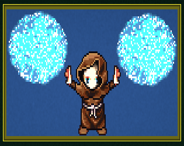

# One click ninja

A game for the game jam
["1-Button Jam 2021"](https://itch.io/jam/1-button-jam-2021)
written in Rust with the [Bevy](https://bevyengine.org) engine.

A rhythm game, where you play a soldier that can defend or use one of three attacks per turn against three kinds of enemies, vulnerable only to certain attacks.

You must press the space bar when the action spinner on the left points at one of the options.

## Running the game

First time you run, you need to run `bin/bootstrap`.

For native development run `bin/run-dev`.

For web development run `bin/run-wasm`.

To deploy, run `bin/build-wasm` to build `target/web.zip`, and then
run `bin/push-wasm` to upload `target/web.zip` to itch.io using `butler`. To install `butler` see [itch.io's documentation](https://itch.io/docs/butler/installing.html).

## Links

The game on itch.io, where you can play the web build: <https://fluffysquirrels.itch.io/one-click-ninja>

## Credits

Programming by Alex Helfet and Daniel Benjamin

Art by David Dawn and from OpenGameArt.org

## License

Licensed under the MIT license, see [LICENSE](./LICENSE)
